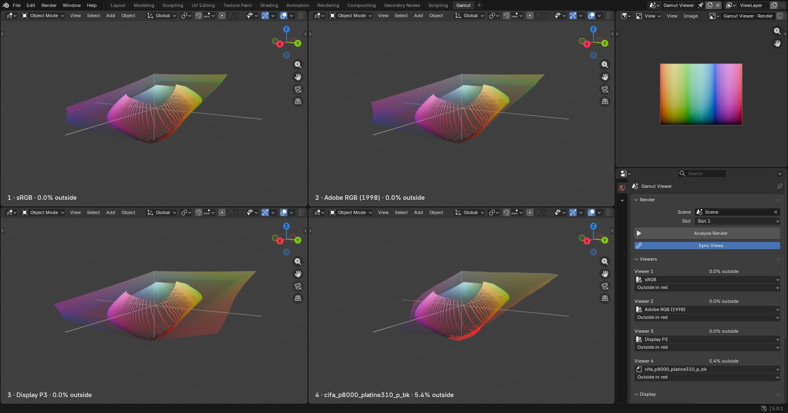

# Gamut Viewer for Blender

See your render's colours as a 3D point cloud inside screen and print gamuts, and find out which colours a paper cannot print before you send the file.



- A **Gamut** workspace with four viewers side by side, each showing the render against its own gamut.
- The gamut is drawn as a transparent shell, **coloured by hue**, so you can see at a glance whether the problem is in the reds, the cyans or the shadows.
- Points the gamut cannot hold turn red, or can be shown alone.
- Each viewer shows the percentage of the image that falls outside.
- Works with sRGB, Adobe RGB, Display P3 and Rec.2020 out of the box, and with any printer or paper **ICC profile** you add.

## Install

1. Download the zip for your system from the [Releases](https://github.com/fitaine/Blender-Gamut/releases) page (Windows, macOS Apple Silicon, macOS Intel or Linux).
2. In Blender, go to **Edit > Preferences > Get Extensions**, open the **▾** menu at the top right and choose **Install from Disk**. Pick the zip.

Needs Blender 5.0 or newer. Tested on Blender 5.0 and 5.1 on Windows. The macOS and Linux builds are not tested yet. Nothing else to install: the colour engine (LittleCMS, through Pillow) comes inside the zip.

## Use

1. Render your image with **F12**.
2. Click **+** at the end of the workspace tabs and choose **Print > Gamut**. The workspace sets itself up the first time: four viewers, the render on the top right, the options below it.
3. In the options, choose the scene and render slot to read, then click **Analyse Render**.
4. Pick a gamut for each of the four viewers. Orbit, pan and zoom in each viewer as in any 3D view, or tick **Sync Views** to move all four together.

The render is read the way it would be saved, with your view transform, look and exposure applied, so what you see is what goes into the file you print.

| Setting | What it does |
|---|---|
| **Sync Views** | Orbit, pan and zoom all four viewers together |
| **Show** (per viewer) | *True colour*, *Outside in red* or *Only outside* |
| **Points** | How many pixels are sampled from the render |
| **Point Size**, **Shell Opacity** | Display only |
| **Coloured Shell** | Paint the shell in its own colours, or plain grey |
| **Tolerance (ΔE)** | For ICC profiles: how far a colour may drift through the profile before it counts as out of gamut |

The Gamut workspace shows its own scene, so switching back to your other workspaces brings your scene back. To render again, go back to your scene's workspace, press F12, then return and click **Analyse Render**.

Enabling the add-on also installs a small app template, which is what puts **Print > Gamut** in the **+** menu. Because of that, *Print* also appears under **File > New**. Disabling the add-on removes it.

## Adding paper and printer profiles

Click **Add ICC…** in the panel and pick one or more `.icc` / `.icm` files. Paper makers publish profiles for each printer and paper on their websites (Canson, Hahnemühle, Epson and others). The file browser opens in your system's colour folder, where installed printer profiles live.

Profiles are copied into the add-on's own folder (the folder button next to **Add ICC…** opens it), so they stay available in every Blender file. Removing a profile from the list never touches your original file.

## How "outside" is decided

- **RGB spaces** (sRGB, Adobe RGB, Display P3, Rec.2020): exactly, from each space's primaries.
- **ICC profiles**: each colour is converted into the profile and back (relative colorimetric). If it comes back more than the tolerance away, the profile cannot reproduce it.

All colours are compared in CIE Lab (D50), the space ICC profiles use.

Renders saved for the sRGB, Display P3, Rec.1886 and Rec.2020 displays are supported. HDR displays are not.

## Build from source

```
python tools/build.py --blender "path/to/blender"
```

This downloads the Pillow wheels listed in `gamut_viewer/blender_manifest.toml` and writes one zip per platform to `dist/`.

The workspace layout lives in `gamut_viewer/app_template/startup.blend`. To change it, edit `tools/make_template.py` and run it with Blender's interface (it quits by itself):

```
blender --factory-startup --python tools/make_template.py
```

## Licence

GPL-3.0-or-later, like Blender. See [LICENSE](LICENSE).
